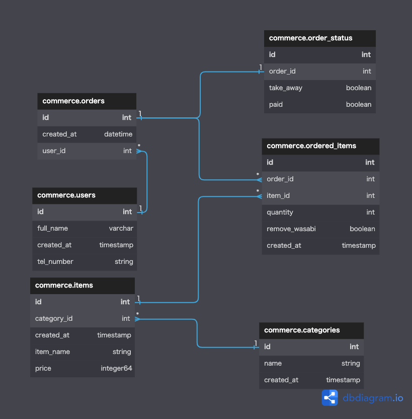

# 課題1
[link](https://dbdiagram.io/d/63788278c9abfc611173cfd5)



# 課題2
* `commerce.ordered_items` にシャリのサイズidを格納するカラムを作成する。
* `commerce.item_sizes` でサイズのid-サイズを持つテーブルを作成する。

---
* 人気の寿司ネタが特定可能な状態にするためには、`orders` に `created_at` を持たせ、クエリ時に絞り込み出来る状態にすれば良い。

# 課題3
[参考資料](https://www.kurasushi.co.jp/takeout/)
[参考資料2](https://edokko.co.jp/mochikaeri2/index-mochikaeri2.html)

* 今後発生しそうな変更
  * 消費税の変更
  * 店内メニューを注文された場合の考慮
  * 複数の割引クーポンの追加
  * お持ち帰りでなく、宅配になる。
    * 注文者のお届け住所
    * 注文する地区に基づく配送料
  * 容器・ラッピングのバリエーション追加

# 課題4 
* mac内でdockerを用いて仮のSQLサーバを建ててみる。
* [参考記事](https://blog.interfamilia.co.jp/2022/07/06/MySQL-%E6%A4%9C%E8%A8%BC%E7%94%A8-Docker-%E7%92%B0%E5%A2%83%E3%82%92%E4%BD%BF%E3%81%A3%E3%81%A6-SQL-%E3%81%AE%E7%B7%B4%E7%BF%92%E3%82%92%E3%81%97%E3%82%88%E3%81%86/)
* [参考リポジトリ](https://github.com/interfamilia/testing-mysql-docker)

## 手順
```
$ docker-compose up -d
# コンテナに潜る
$ docker exec -it testing-mysql /bin/bash

# 
$ mysql -u root -p
```


