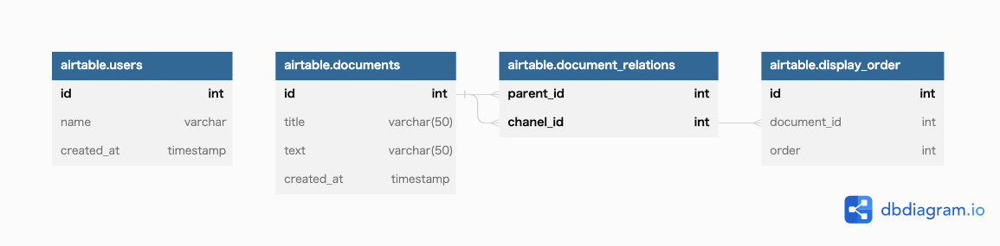
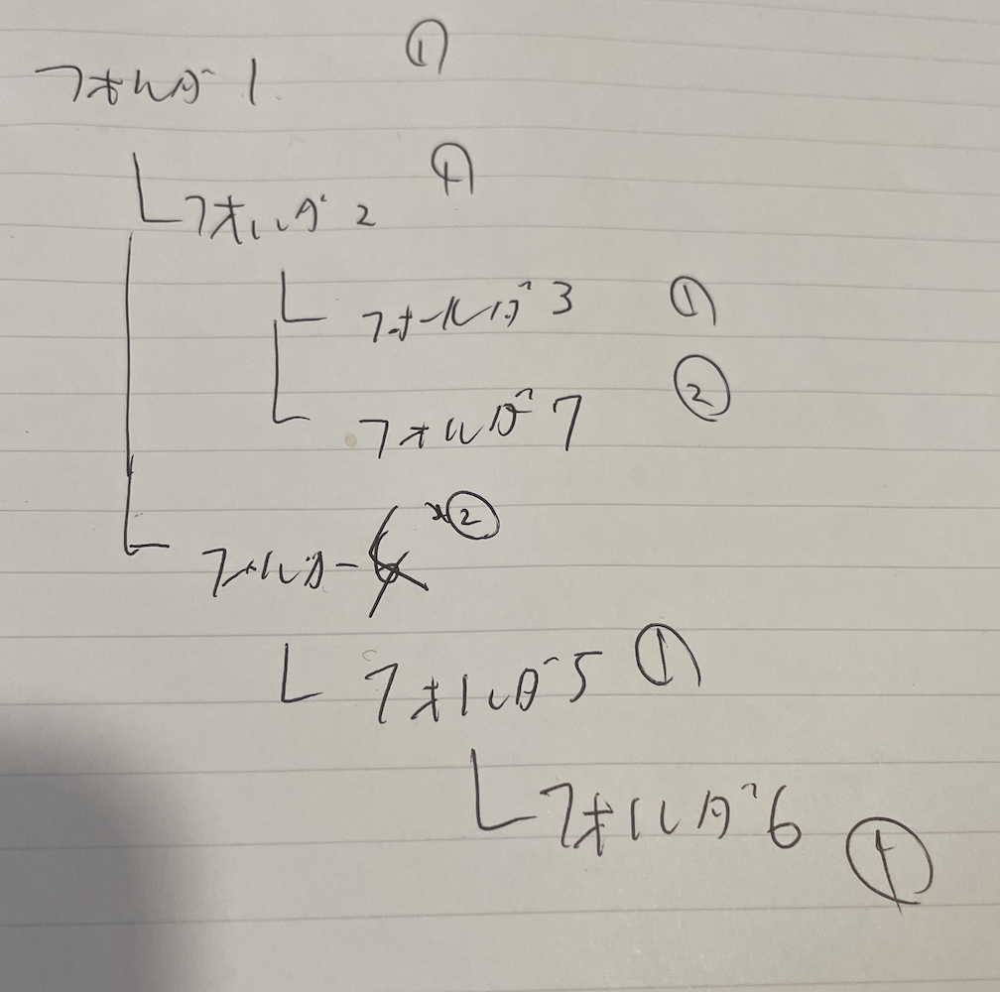
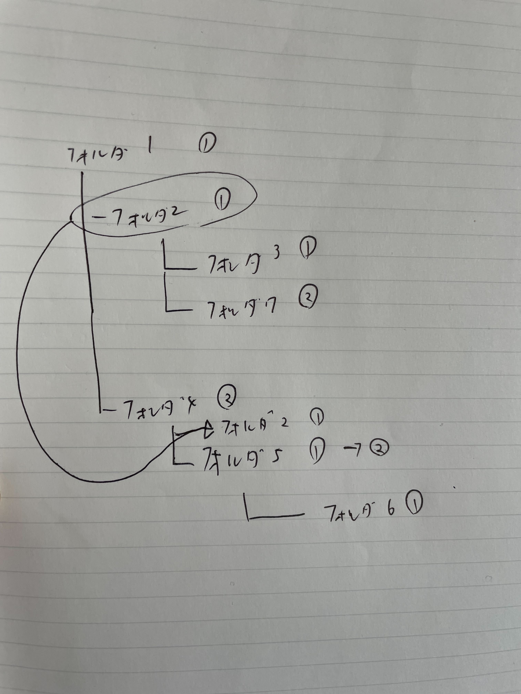

# db modeling 3



```
(base) ➜  usecase git:(main) ✗ docker-compose up -d
(base) ➜  usecase git:(main) ✗ docker exec -it mysql-container bash
hostname -i
# mysql -h 172.23.0.2 -P 3306 -u root -p
mysql -u root -p
```

# 要件

https://shared-brake-3fd.notion.site/DB-3-bab0923d811140ca9d1421d2ebc0d53c

# 構造



# サンプルクエリ

子孫

```mysql
mysql> SELECT documents.* FROM documents INNER JOIN document_relations ON documents.id = document_relations.child_id WHERE parent_id = 2;
+----+------------+--------+---------------------+
| id | title      | text   | created_at          |
+----+------------+--------+---------------------+
|  2 | Document 2 | Text 2 | 2023-02-06 07:01:53 |
|  3 | Document 3 | Text 3 | 2023-02-06 07:01:53 |
|  7 | Document 7 | Text 7 | 2023-02-06 07:01:53 |
+----+------------+--------+---------------------+
3 rows in set (0.03 sec)
```

先祖

```
mysql> SELECT documents.* FROM documents INNER JOIN document_relations ON documents.id = document_relations.parent_id WHERE child_id = 7;
+----+------------+--------+---------------------+
| id | title      | text   | created_at          |
+----+------------+--------+---------------------+
|  1 | Document 1 | Text 1 | 2023-02-06 07:01:53 |
|  2 | Document 2 | Text 2 | 2023-02-06 07:01:53 |
|  7 | Document 7 | Text 7 | 2023-02-06 07:01:53 |
+----+------------+--------+---------------------+
3 rows in set (0.03 sec)

```

削除

```
# それより深い階層側が消える
DELETE FROM document_relations WHERE child_id = 5;

# 葉ノード削除
DELETE
FROM document_relations
WHERE child_id IN (SELECT child_id FROM document_relations WHERE parent_id = 5);

# https://qiita.com/Kohei-Sato-1221/items/d1cbdc1d3affcd9c3a9e
DELETE FROM document_relations WHERE child_id IN (SELECT child_id FROM (SELECT child_id FROM document_relations WHERE parent_id = 5) AS tmp);

mysql> SELECT * FROM document_relations;
+-----------+----------+
| parent_id | child_id |
+-----------+----------+
|         1 |        1 |
|         1 |        2 |
|         2 |        2 |
|         1 |        3 |
|         2 |        3 |
|         3 |        3 |
|         1 |        4 |
|         4 |        4 |
|         1 |        7 |
|         2 |        7 |
|         7 |        7 |
+-----------+----------+
11 rows in set (0.07 sec)

```

# 付け替え

フォルダ 2 を フォルダ 4 の下に付け替える。


```
mysql> DELETE FROM document_relations
       WHERE child_id IN (SELECT x.id FROM (SELECT child_id AS id FROM document_relations WHERE parent_id = 4) AS x) AND
       parent_id IN (SELECT y.id FROM (SELECT parent_id AS id FROM document_relations WHERE child_id = 4 AND child_id != parent_id) AS y) ;
Query OK, 2 rows affected (0.11 sec)

# 付け替えるサブツリー
mysql> SELECT supertree.parent_id, subtree.child_id FROM document_relations AS
       supertree CROSS JOIN document_relations AS subtree
       WHERE supertree.child_id = 4 AND subtree.parent_id = 2;
+-----------+----------+
| parent_id | child_id |
+-----------+----------+
|         4 |        2 |
|         4 |        3 |
|         4 |        7 |
+-----------+----------+
3 rows in set (0.02 sec)

# INSERT
mysql>  INSERT INTO document_relations (parent_id, child_id)
        SELECT supertree.parent_id, subtree.child_id FROM document_relations AS
        supertree CROSS JOIN document_relations AS subtree WHERE supertree.child_id = 4
        AND subtree.parent_id = 2;

Query OK, 3 rows affected (0.05 sec)
Records: 3  Duplicates: 0  Warnings: 0

```

# 表示順の変更

## 方針

- ドキュメント側に持たせている display_order をインクリメントする。
- 更新後、フォルダ 4 の子ノードを取得
- フォルダ 2 を表示順番 1 に持ってくる場合、それ以降の表示順をインクリメントする。
- フォルダ 2 を表示順番 2 に持ってくる場合、フォルダ 2 の表示順を 2 にアップデートする。

### 付け替え前

```mysql
mysql> SELECT * FROM display_orders;
+----+-------------+--------------+
| id | document_id | order_number |
+----+-------------+--------------+
|  1 |           1 |            1 |
|  2 |           2 |            1 |
|  3 |           3 |            1 |
|  4 |           4 |            2 |
|  5 |           5 |            1 |
|  6 |           6 |            1 |
|  7 |           7 |            2 |
+----+-------------+--------------+
7 rows in set (0.04 sec)
```

### フォルダ 2 をフォルダ 4 の下で表示順 1 に持ってくる場合。

- 付け替えのクエリは、先程と同じなので省略する。
- 付け替えたあと、表示順をアップデートする。



```mysql
# 同じ階層のフォルダを取得

mysql> SELECT parent_id, child_id FROM document_relations WHERE parent_id = 4 AND parent_id != child_id AND child_id IN (SELECT parent_id FROM document_relations WHERE parent_id != 4 AND parent_id !=
child_id) GROUP BY parent_id, child_id;
+-----------+----------+
| parent_id | child_id |
+-----------+----------+
|         4 |        2 |
|         4 |        5 |
+-----------+----------+
2 rows in set (0.02 sec)

mysql>

```

この後に、同じ階層のディレクトリの表示順をアップデートすれば良い。
