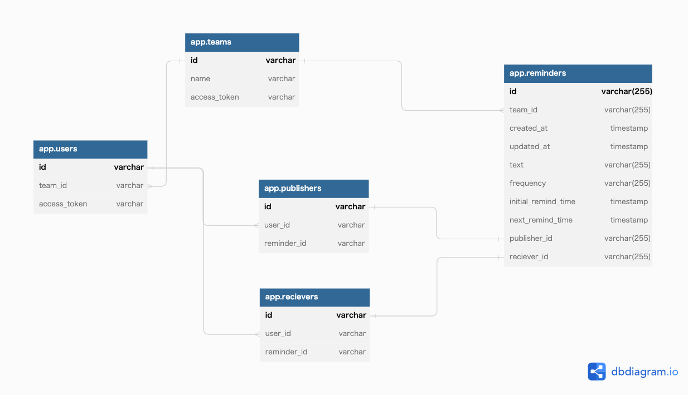

# db modeling 4



```
(base) ➜  usecase git:(main) ✗ docker-compose up -d
(base) ➜  usecase git:(main) ✗ docker exec -it mysql-container bash
hostname -i
# mysql -h 172.23.0.2 -P 3306 -u root -p
mysql -u root -p
```

# サンプルクエリ
* 使用できるのは、シードデータの投入後とする。

## 新reminder の追加
```mysql
INSERT INTO `app`.`reminders` (`id`, `team_id`, `created_at`, `updated_at`, `text`, `frequency`, `initial_remind_time`, `next_remind_time`, `publisher_id`, `reciever_id`)
VALUES
('a0sd22-afdb-4a43-b37e-dbf844376711', 'team1', NOW(), NOW(), 'Reminder 4', 'daily', NOW(), NOW(), '1', '1'),
('seff2d0d-3179-4a7d-a21a-0e7e172df45b', 'team1', NOW(), NOW(), 'Reminder 5', 'weekly', NOW(), NOW(), '2', '3'),
('a0ra4a22-4d9a-4c5d-a620-6fcd5b5e47df', 'team2', NOW(), NOW(), 'Reminder 6', 'monthly', NOW(), NOW(), '4', '4');
```

## バッチ処理後の `reminders.next_remind_time` アップデート
* `reminders.frequency`, `reminders.initial_remind_time` の2つをアプリ側で読み取り、バッチ処理のtimestampとこの2つを考慮して、アプリ側から `reminders.next_remind_time` をアップデートする。
